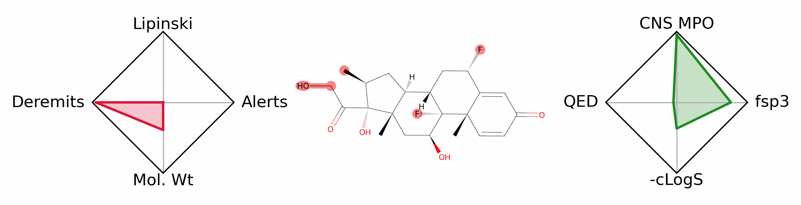
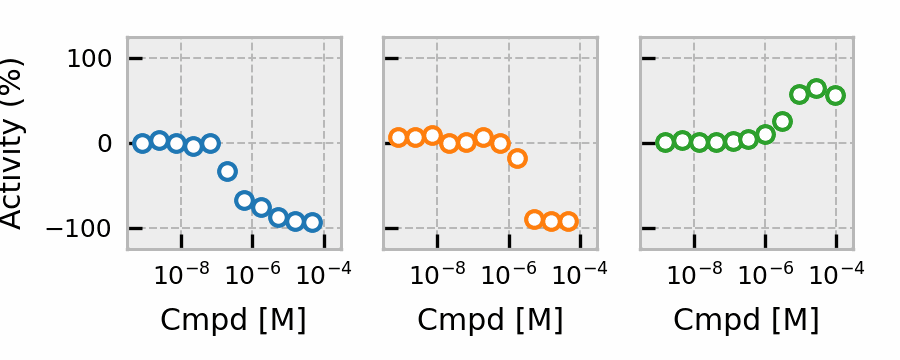
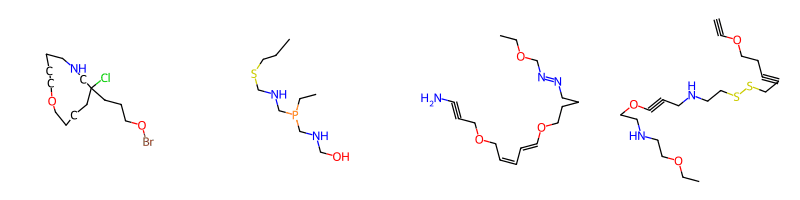

# Selected projects

Thanks for your interest in my projects! Here are a few of my favorites:

- [mol_cv](https://github.com/prheenan/mol_cv): calculation of useful chemical properties

- [dghf (Darn Good Hill Fit)](https://github.com/prheenan/dghf), a robust [Hill equation](https://en.wikipedia.org/wiki/Hill_equation_(biochemistry)) fitter

- [plate_tx](https://github.com/prheenan/plate_tx.git): manipulation and visualization of plate-based data

- [mol_from_text](https://github.com/prheenan/mol_from_text), a 'just for fun' repository to turn text into molecules

